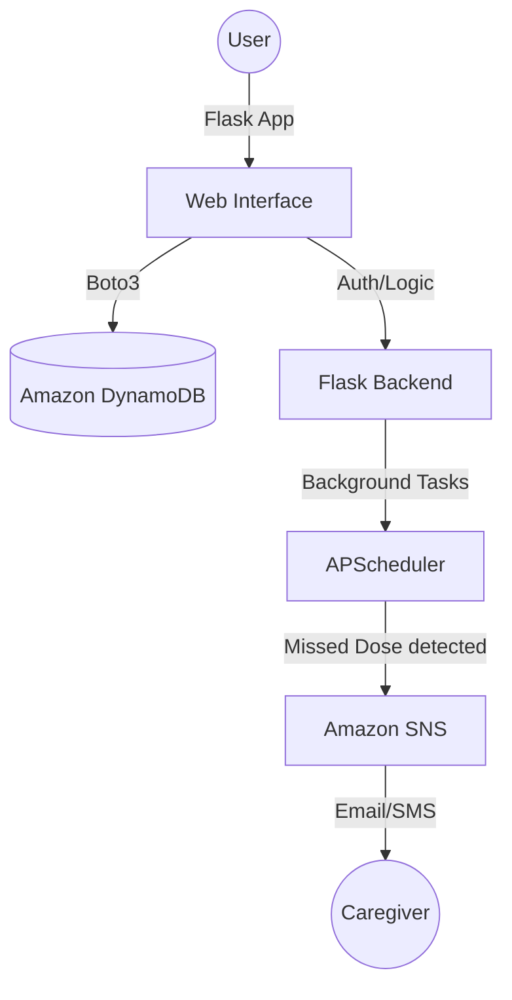

# MedTrack 💊

**MedTrack** is a premium Medication Adherence Monitoring System built with Flask, AWS DynamoDB, and AWS SNS. It helps patients stay on track with their medications while keeping caregivers informed through automated alerts for missed doses.

## 🚀 Features

- **Personalized Dashboard**: Real-time adherence tracking with visual progress rings.
- **Medication Management**: Easy-to-use interface to add, edit, and delete prescriptions.
- **Intelligent Reminders**: Background scheduling that identifies missed doses.
- **Caregiver Alerts**: Instant SMS/Email notifications via AWS SNS when a dose is missed.
- **History & Logs**: Complete audit trail of medication intake.
- **Modern UI**: Premium, responsive design with glassmorphism aesthetics.

## 🏗️ Architecture



## 🛠️ Tech Stack

- **Backend**: Python, Flask, APScheduler
- **Database**: Amazon DynamoDB
- **Notifications**: Amazon SNS
- **Frontend**: HTML5, Vanilla CSS, JavaScript
- **Icons**: Font Awesome 6

## ⚙️ Setup & Installation

### 1. Clone the repository
```bash
git clone https://github.com/your-username/medtrack.git
cd medtrack
```

### 2. Set up virtual environment
```bash
python -m venv venv
source venv/bin/activate  # On Windows: venv\Scripts\activate
```

### 3. Install dependencies
```bash
pip install -r requirements.txt
```

### 4. Configure Environment Variables
Create a `.env` file from the example:
```bash
cp .env.example .env
```
Fill in your AWS credentials and Flask secret key.

### 5. AWS Resources
MedTrack automatically creates the following DynamoDB tables on first run:
- `medtrack_users`
- `medtrack_medications`
- `medtrack_logs`

**Note**: You must manually create an **SNS Topic** in the AWS Console and provide its ARN in the `.env` file to enable alerts.

## 🏃 Running the App

```bash
python app.py
```
The application will be available at `http://127.0.0.1:5000`.

## 📂 Project Structure

- `app.py`: Main Flask application and scheduler.
- `config.py`: Environment configuration and AWS settings.
- `templates/`: Jinja2 HTML templates.
- `static/`: CSS and JavaScript assets.
- `cron/`: Standalone scripts for CLI/Cron reminders.

## 📄 License

This project is licensed under the [MIT License](LICENSE).
